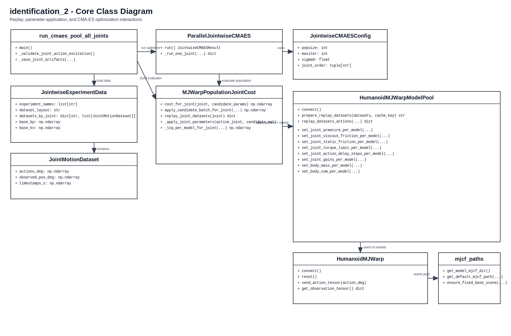

# LeRobot Identification (`identification_2`)

`identification_2` is a standalone repository for joint-wise dynamics identification on the LeRobot humanoid with MJWarp + CMA-ES.

## Scope

This repo focuses on:

- batched simulation replay across multiple datasets/configurations
- CMA-ES identification of simulator parameters

Real-robot acquisition/delay tooling is intentionally out of scope.

## Quick Start

Run from this repository root (`identification_2/`):

```bash
git submodule update --init --recursive
uv sync
```

## Repo Layout

- `cmaes/`: optimization entrypoints and objective logic
- `simulator/`: batched MJWarp runtime/model pool
- `models/lerobot_humanoid/`: humanoid constants + compatibility exports
- `simulator/mjcf_paths.py`: MJCF path resolution and fixed-base scene generation
- `lerobot-humanoid-models/`: model dependency (git submodule)
- `results/baseline_controller_v1/pool_jointwise_20260403_132618`: reference identification output
- `helper.py`: small helper for manual checks

## Model Dependency

This repository requires the local `lerobot-humanoid-models` submodule (bipedal no-arms model):

```bash
git submodule update --init --recursive
```

`simulator/mjcf_paths.py` resolves MJCF from `lerobot-humanoid-models`.
No pip install of `lerobot-humanoid-models` is required for normal use in this repo.

## Dataset In This Repo

- Dataset bundle kept in repo: `models/lerobot_humanoid/datasets/baseline_controller_v1`
- Reference identification output: `results/baseline_controller_v1/pool_jointwise_20260403_132618`

Dataset layout currently tracked in this repo is `grouped_by_joint`:

```text
models/lerobot_humanoid/datasets/baseline_controller_v1/
  experiment_2s_step_inv/
    right_knee/
      meta/info.json
      data/chunk-000/file-000.parquet
    left_knee/
    ...
```

The loader also supports `per_experiment` layout:

```text
<datasets-root>/<experiment>/
  meta/info.json
  data/chunk-000/file-000.parquet
  meta/episodes/chunk-000/file-000.parquet
```

## Typical Run

```bash
uv run python -m cmaes.run_cmaes_pool_all_joints \
  --datasets-root models/lerobot_humanoid/datasets/baseline_controller_v1 \
  --dataset-layout auto \
  --fixed-base \
  --sim-dt 0.005 \
  --device cuda \
  --pool-multiprocessing --pool-mp-start-method spawn \
  --pool-pin-workers-to-cores \
  --pool-prefer-physical-cores \
  --pool-worker-num-threads 1 \
  --popsize 16 --maxiter 100 --sigma0 0.12 \
  --armature-scale-lb 0.1 --armature-scale-ub 10.0 \
  --viscous-scale-lb 0.1 --viscous-scale-ub 10.0 \
  --dry-scale-lb 0.1 --dry-scale-ub 10.0 \
  --mass-scale-lb 1.0 --mass-scale-ub 1.01 \
  --com-scale-lb 1.0 --com-scale-ub 1.01 \
  --no-optimize-gain-scale \
  --progress-every 1 \
  --out-dir results/release_run
```

## CPU Smoke Run

```bash
uv run python -m cmaes.run_cmaes_pool_all_joints \
  --datasets-root models/lerobot_humanoid/datasets/baseline_controller_v1 \
  --experiments experiment_2s_step_inv experiment_2s_sinus_0.5 \
  --dataset-layout auto \
  --fixed-base \
  --device cpu \
  --popsize 4 --maxiter 2 --sigma0 0.3 \
  --joint-order right_knee left_knee \
  --out-dir results/smoke_cpu_release
```

The command line interface is defined in `cmaes/run_cmaes_pool_all_joints.py` (`--help` shows all options):

```bash
uv run python -m cmaes.run_cmaes_pool_all_joints --help
```

## Outputs

Each run creates a timestamped folder:

- `results/<out-dir>/pool_jointwise_YYYYmmdd_HHMMSS/config.yaml`
- `results/<out-dir>/pool_jointwise_YYYYmmdd_HHMMSS/summary_partial.yaml`
- `results/<out-dir>/pool_jointwise_YYYYmmdd_HHMMSS/summary.yaml`
- `results/<out-dir>/pool_jointwise_YYYYmmdd_HHMMSS/<joint>/best_joint_result.yaml`
- `results/<out-dir>/pool_jointwise_YYYYmmdd_HHMMSS/<joint>/history.csv`

## Architecture

- Class and call-contract diagram source: `docs/class_diagram.md`
- Rendered diagram:


