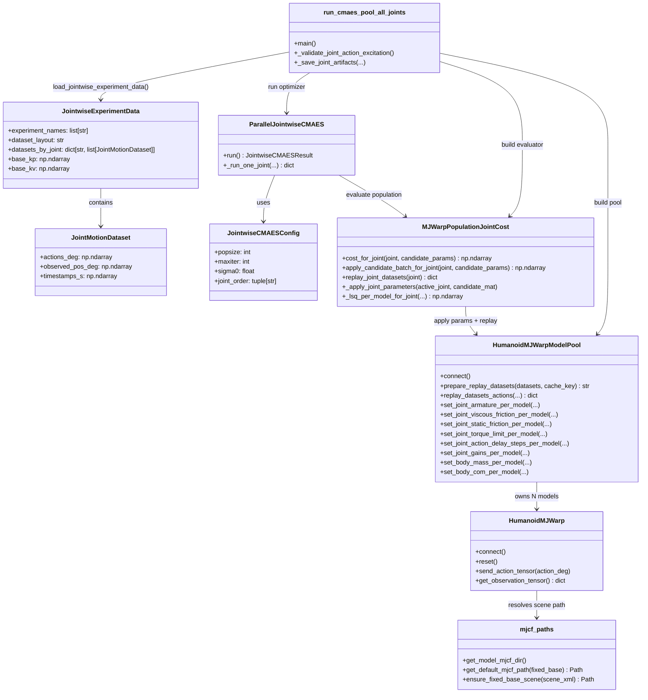

# Identification_2 Class Diagram

This diagram is a proper class diagram for the core replay + identification path.
Rendered SVG: `docs/class_diagram.svg`.

## Call Contracts

- `JointMotionDataset.actions_deg`: shape `(T, 12)`, order must match `JOINT_ORDER`.
- Canonical `JOINT_ORDER` and baseline gains source: `simulator/robot_spec.py`.
- Population matrix contract in CMAES: `candidate_params.shape == (popsize, n_param)`.
- Replay contract: `len(datasets) == nworld`.
- Cost return contract: LSQ vector shape `(popsize,)`, one cost per model candidate.
